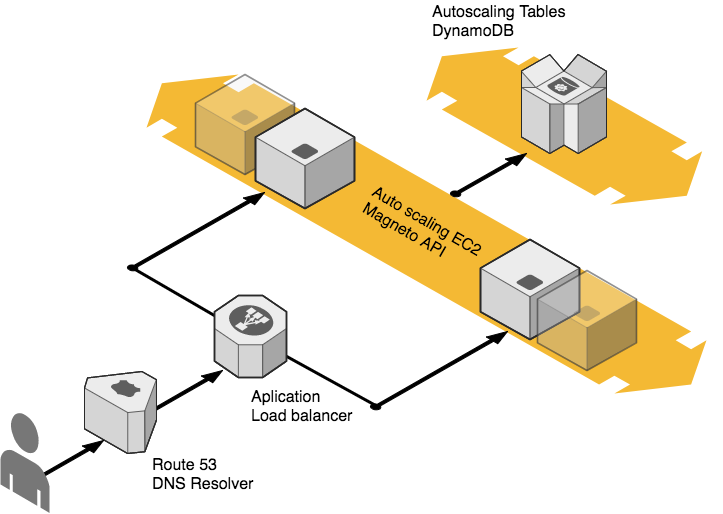

# Magneto api - Meli challenge

[](https://codecov.io/gh/gvquiroz/it-challenge-ml)
[](https://travis-ci.org/gvquiroz/it-challenge-ml)

Magneto quiere reclutar la mayor cantidad de mutantes para poder luchar contra los X-Men

## Infra


## Endpoints
/v1/mutant

/v1/stats

## Usage

La api /mutant/ detecta si un humano es mutante enviando la secuencia de ADN mediante un HTTP POST
En caso de verificar un mutante, devuelve un HTTP 200-OK, en caso contrario un 403-Forbidden

```
POST → /mutant/ 
BODY {“dna”:["ATGCGA","CAGTGC","TTATGT","AGAAGG","CCCCTA","TCACTG"]}
```

La api /stats/ devuelve un Json con las estadísticas de las verificaciones de ADN: 

{“count_mutant_dna”:40, “count_human_dna”:100, “ratio”:0.4}

```
GET→“/stats/” 
```

---

## Setup develop
Core specs: Java 7, Jersey, Grizzly, Dynamo db

Es necesario tener instalado Maven 3.5.0, Java 7 y Docker

- Clonar el repo en su directorio favorito.
Git clone https://github.com/gvquiroz/it-challenge-ml.git

- Bajar las dependencias, correr los test local
mvn:test

- Levantar el storage local, en este caso utilizaremos Dynamodb. Crear el schema.

```
docker run -d -p 8000:8000 dwmkerr/dynamodb
```

Luego de tener dynamodb corriendo local. Ejecutar la clase CreateDBSchema (que se encuentra dentro del proyecto/utils) para crear el schema.

- Levantar la api local (por default levantara la api en el Puerto 8080)
mvn exec:java

http://localhost:8080/v1/stats

Notas: Para correr los tests end to end deberá parar el container de dynamo db y el servicio (por conflictos de puertos) ya que estos levantan en memoria los mismos.

### Overview

### Picos de trafico dinamicos (un rango de 100 hasta picos de 1 millón de request por segundo)

Para ello se tomó como unidad mínima de server uno que pueda responder en average 200 req/seg y se decidio escalarlo horizontalmente. Esto fue implementado con un Autoscaling group de Amazon web services que va ajustando la cantidad de servers según la carga correspondiente

Para el storage se utilizó el autoscaling de dynamo db para acompañar los req/seg

### Secret management
La aplicación solo necesita credenciales para acceso al servicio de Aws de DynamoDB, para ello se creo un un rol de aws con solo acceso a dynamodb que esta asignado al server. La aplicación consigue estas credenciales con la metadata del servidor en el cual se ejecuta.

El acceso al servidor es por pem y no esta compartido.

### Env local 
Se utiliza dynamo db en un container aparte en vez de que sea levantado en memoria cuando se arranca la aplicación local para poder ser probado local en modo cluster. En el caso de levantar varias aplicaciones todas le pegarían al dynamo db del container. Simulando un ambiente más parecido a prod.

## Futures/Contemplaciones

### Algoritmo 
Se contempló agregar un algoritmo de compresión de strings para ahorrar storage a costo de cpu. Pero fue priorizado el cpu sobre el storage.

### Tests
Ahora mismo con el goal de mvn:test corre los tests unitarios, de integración y end to end. Seria interesante dividir estos tests en distintos goals y que sean ejecutados en distintas etapas del pipeline de ci/cd.

Los test end to end se podrían extender para agregar tests de benchmark/performance con un threshold a superar.

### Error handling y respuestas
Como el ejercicio solo plantea devolver ok o forbidden según el caso. Se consideró que está bien que no devuelva ningún tipo de información extra al ser intencional este comportamiento.

### Capacity planning y configuration fina
No se realizo configuración fina del threads pools de java al reservarse ese paso para un tuning mas empírico.

### Security Deployment Monitoreo Logging
No fueron contemplados en el scope del ejercicio.
